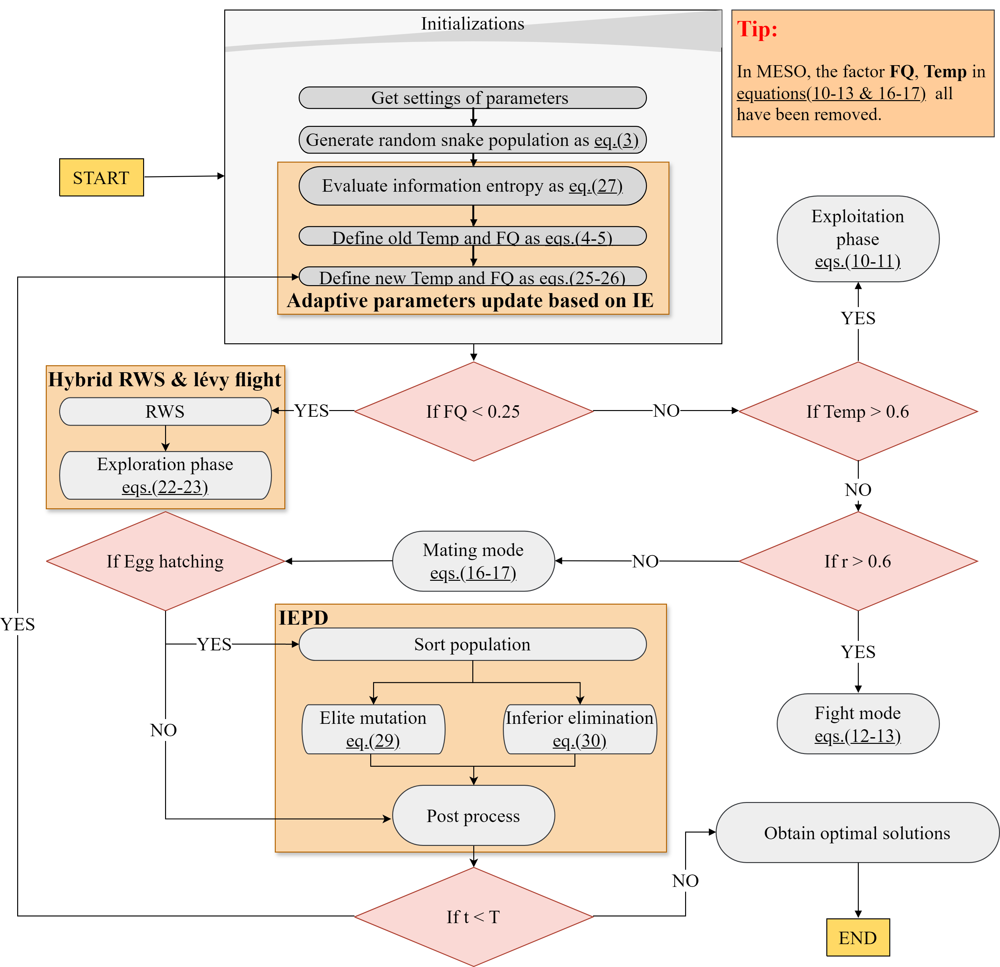
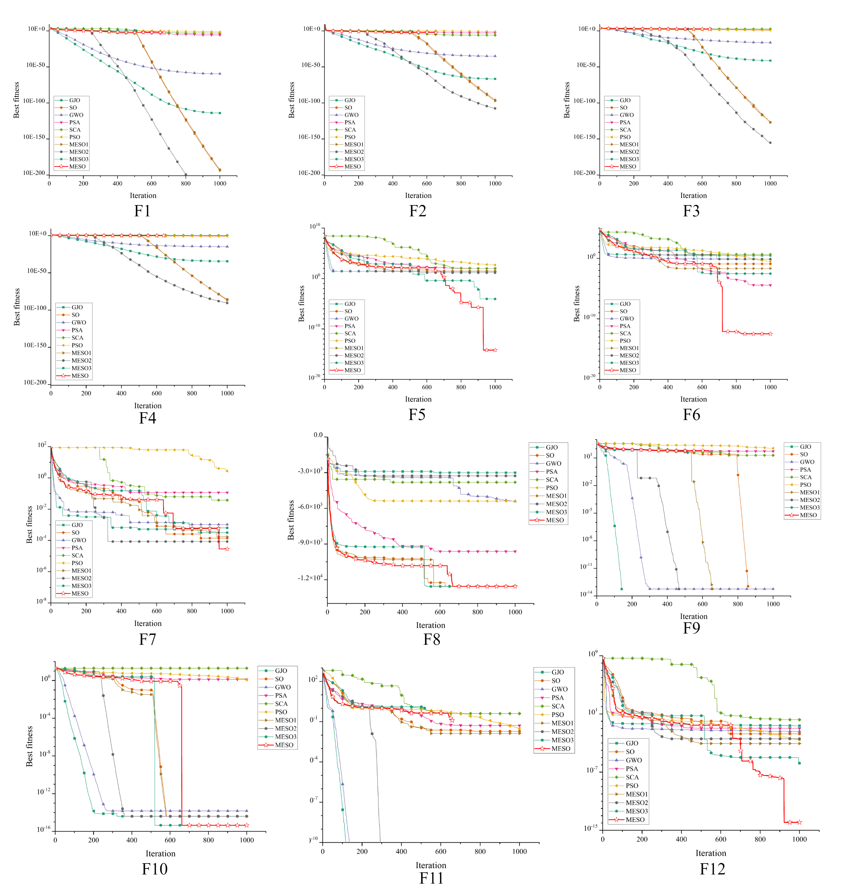
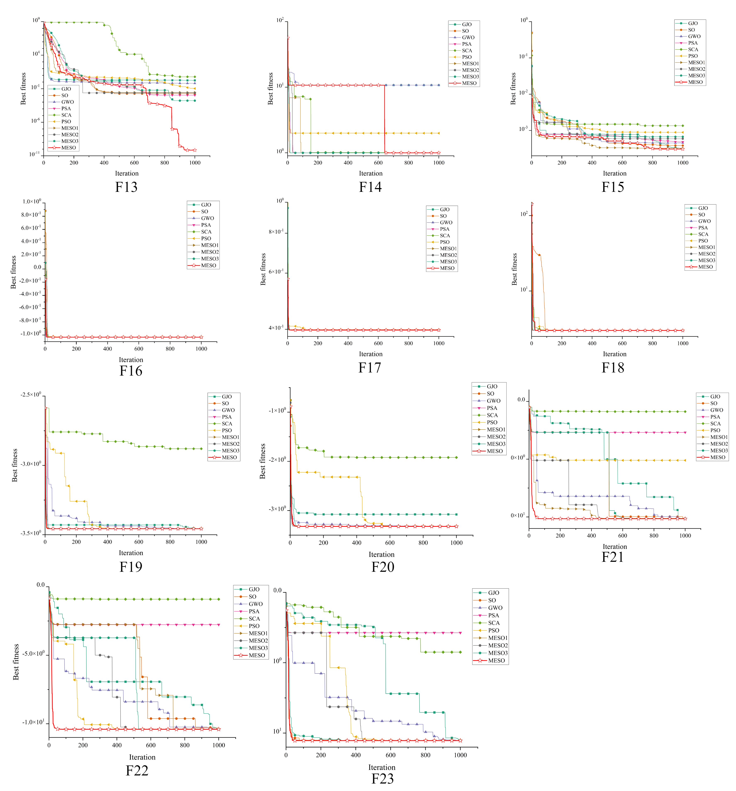
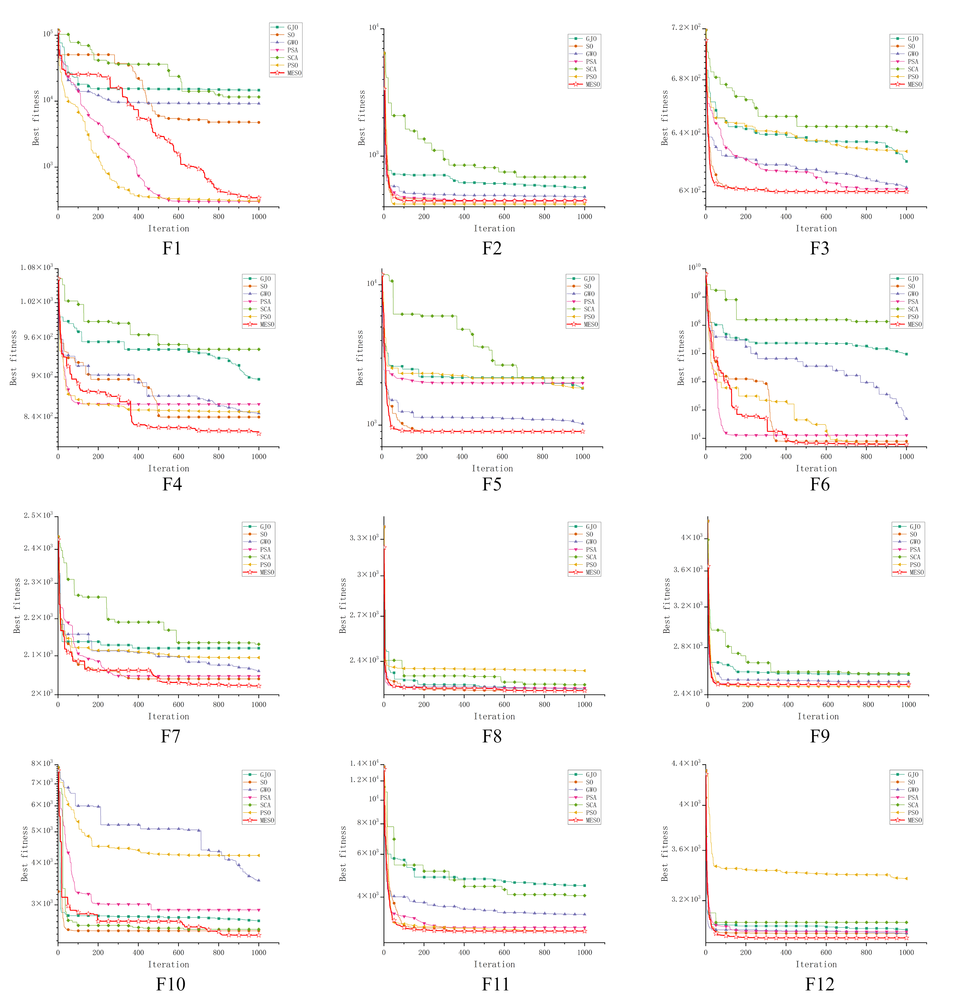
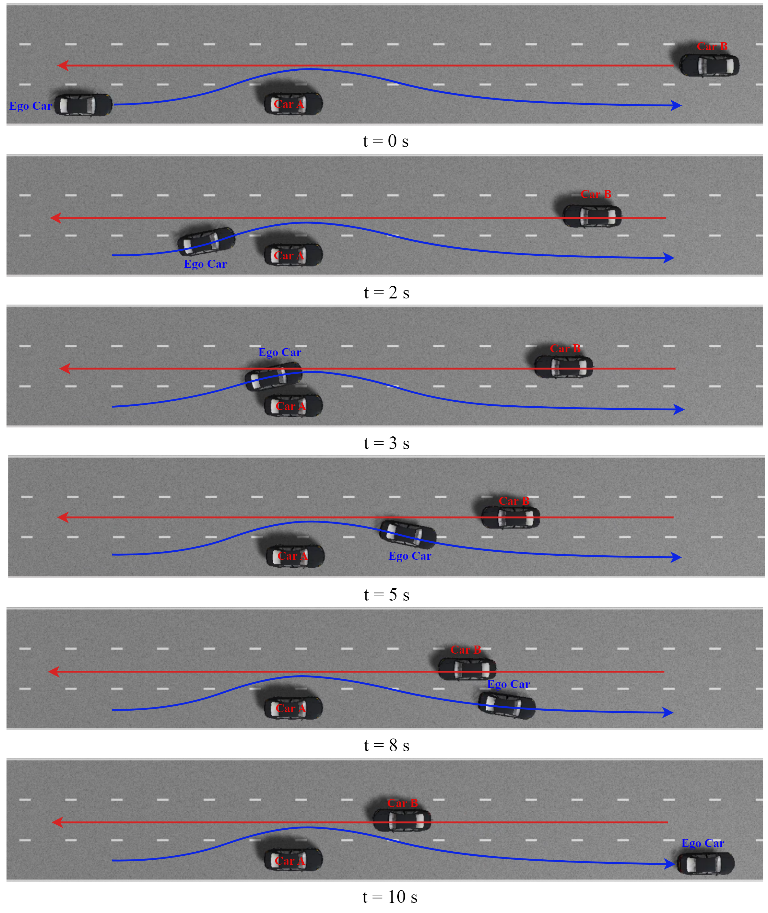
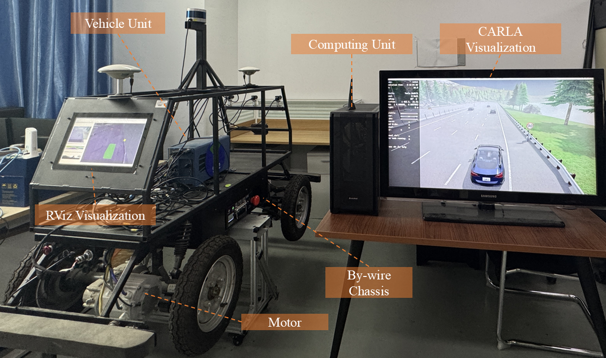
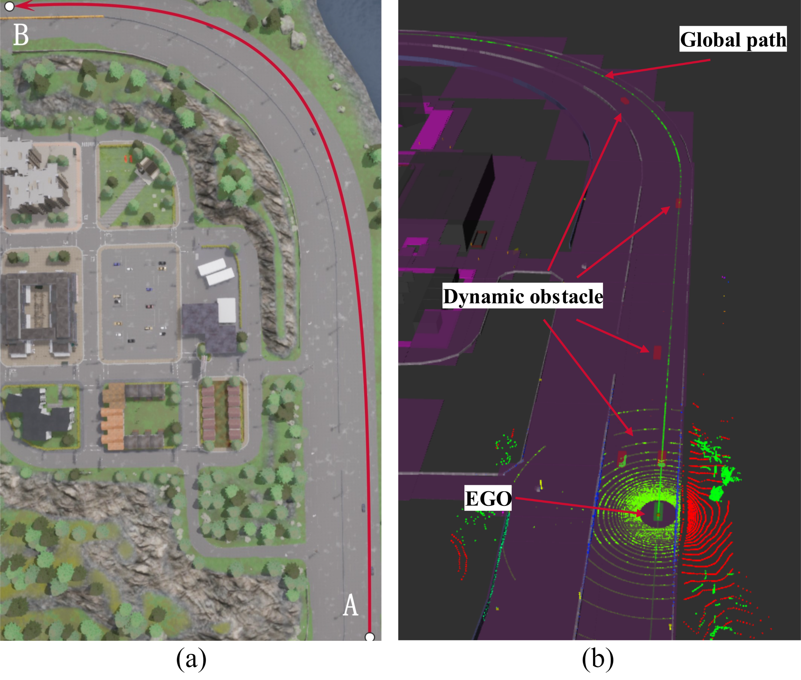
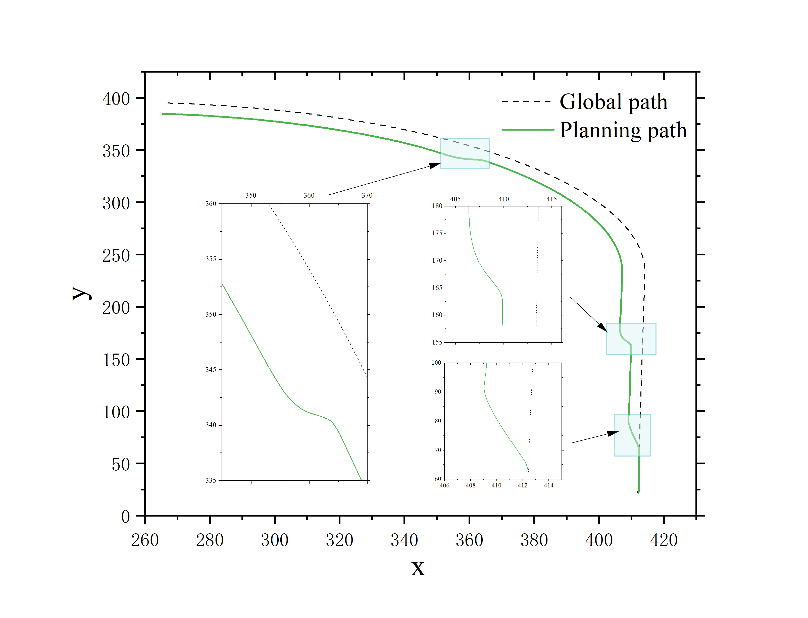
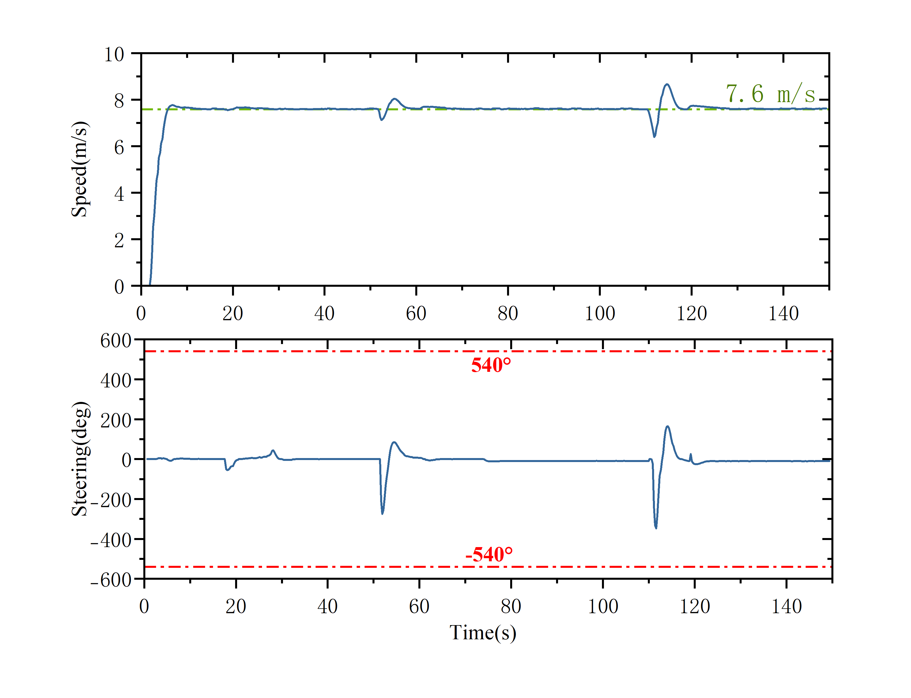

# MESO: A Multi-strategy Enhanced Snake Optimizer

## Updates

- **[August 30, 2025]** Our paper "[MESO: A Multi-strategy Enhanced Snake Optimizer Applied to Autonomous Vehicle Motion Planning](https://link.springer.com/article/10.1007/s10586-025-05273-5)" has been published.

- **[March 25, 2025]** Our paper has been accepted in Cluster Computing.

## Introduction

This repository contains the open-source code for the paper titled "MESO: A Multi-strategy Enhanced Snake Optimizer Applied to Autonomous Vehicle Motion Planning," which has been accepted by the journal *Cluster Computing*.


## Algorithm

MESO enhances the original Snake Optimizer (SO) with three key strategies:

- **IE-based adaptive parameter update** — dynamically adjusts parameters using population information entropy
- **Hybrid RWS + Lévy flight** — improves global search diversity in the exploration phase
- **IEPD** — promotes elite individuals and eliminates inferior ones to accelerate convergence

<p align="center">
  
</p>

## Features

- This study employed a snake optimizer (SO) enhanced with multiple advanced strategies.
- MESO demonstrated exceptional performance in 23 benchmark functions and the CEC2022 experiments.
- MESO efficiently obtains spatio-temporal planning solutions in both simulation and Hardware-in-the-loop test.

## Results

### Benchmark Functions (23 Classical)

Convergence curves comparing MESO against state-of-the-art algorithms on 23 classical benchmark functions (F1–F23).

<p align="center">
  
</p>

<p align="center">
  
</p>

### CEC2022

<p align="center">
  
</p>

### Application: Autonomous Vehicle Motion Planning

#### Simulation

The ego vehicle successfully performs a lane change maneuver to overtake a slower preceding vehicle while a faster oncoming vehicle approaches from the opposite lane. MESO generates a smooth and collision-free spatio-temporal trajectory.

<p align="center">
  
</p>

#### Hardware-in-the-Loop (HIL)

The HIL test platform integrates a physical vehicle unit, an onboard computing unit, and CARLA-based visualization, validating MESO's real-time planning capability on embedded hardware.

<p align="center">
  
</p>
<p align="center">
  
</p>


<p align="center">
  
  &nbsp;
  
</p>

## Installation

Please ensure that you have the following software installed:
- MATLAB R2023b

## Usage Instructions

1. Clone the repository:
    ```bash
    git clone https://github.com/Qilinn-Robotics/MESO-2025.git
    cd MESO-2025
    ```

2. Open MATLAB and run the `main.m` script:
    ```matlab
    run('main.m');
    ```

## Contact Information

If you have any questions or collaboration inquiries, please contact:
- **Authors**: Qilin Li, Chunyan Zhang, Qihua Ma, Xin Weng
- **Email**: qilin516@outlook.com
